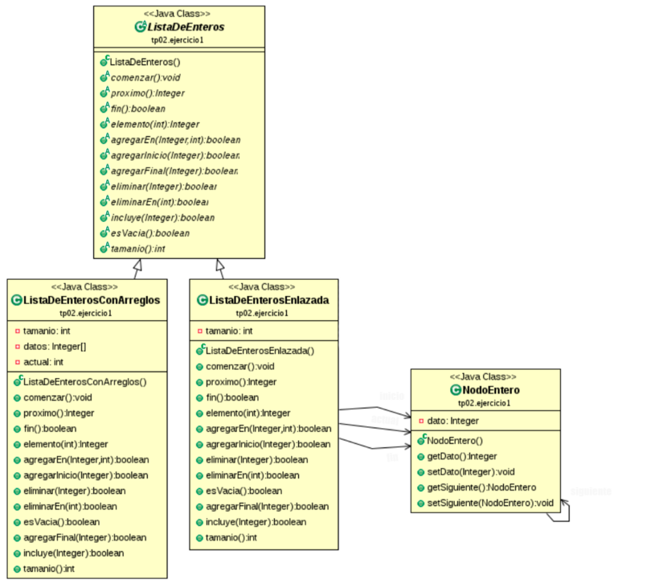
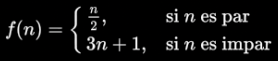
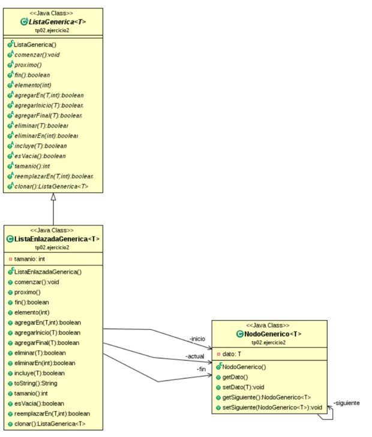
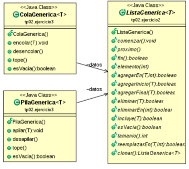

<h1 align="center">☕Practica N°1 </h1>

**Importante:** Descargue el material disponible en el sitio de la cátedra. Se recomienda trabajar a partir de esta práctica en un mismo proyecto (**Ayed**) y crear un paquete por cada ejercicio.

### ```1)``` Considere la siguiente especificación de operaciones de una lista de enteros:

```Java
comenzar(): //Se prepara para iterar los elementosde la lista.
proximo(): //Devuelve el elemento actual y avanza al próximo elemento de la lista.
fin(): //Determina si llegó o no al final de la lista.
elemento(int pos): //Retorna el elemento de la posición indicada
agregarEn(Integer elem, int pos): //Agrega el elemento en la posición indicada y retorna true si pudo agregar y false; si no pudo agregar.
agregarInicio(Integer elem): //Agrega al inicio de la lista.
agregarFinal(Integer elem): //Agrega al final de la lista.
eliminar(Integer elem): //Elimina elem de la lista y retorna true si lo pudo hacer y false si no lo encuentra.
eliminarEn(int pos): //Elimina el elemento de la posición indicada y retorna true si lo pudo eliminar y false en caso contrario.
incluye(Integer elem): // Retorna true si elem está contenido en la lista, false en caso contrario.
esVacia(): //Retorna true si la lista está vacía, false en caso contrario.
tamanio(): //Retorna la cantidad de elementos.
```
<div align="center"> 

 </div>

```1.1)``` Importe en Eclipse  **ListasDe Enteros.zip** dado por la cátedra usando la opción Import > Existing Proyects into Workspace, y luego click en ``Select archive file`` y seleccione al archivo .zip descargado. Para poder usar las listas de enteros y sus operaciones, en cada una de las declaraciones de clases se debe agregar **import tp02.ejercicio1.***;

```1.2)``` Escriba una clase llamada **TestListaDeEnterosConArreglos** que reciba en su método **main** una secuencia de números, los agregue a un objeto de tipo **ListaDeEnterosConArreglos** y luego imprima los elementos de dicha lista. [Resolución](#Ejercicio_1.2)

```1.3)``` Escriba una clase llamada **TestListaDeEnterosEnlazada** que reciba en su método **main** una secuencia de números, los agregue a un objeto de tipo **ListaDeEnterosEnlazada** y luego imprima los elementos de dicha lista. [Resolución](#Ejercicio_1.3)

```1.4)``` ¿Qué diferencia encuentra entre las implementaciones de los puntos anteriores? [Resolución](#Ejercicio_1.4)

```1.5)``` Escriba un método recursivo que imprima los elementos de una lista en sentido inverso. La lista la recibe por parámetro. [Resolución](#Ejercicio_1.5)

```1.6)``` Se aplica la siguiente función de forma recursiva a partir de un número n positivo se obtiene un sucesión que termina en 1:  [Resolución](#Ejercicio_1.6)

<div align="center"> 

 </div>

Por ejemplo para n = 6, se obtiene la siguiente sucesión:

- 1) f(6) = 6/2 = 3
- 2) f(3) = 3*3 + 1 = 10
- 3) f(10) = 10/2 = 5
- 4) ... 

Es decir la sucesión 6, 3, 10, 5, 16, 8, 4, 2, 1. Para cualquier n con el que se arranque siempre se llegará al 1.

- ```a)```  Escriba un programa recursivo que, a partir de un número n, devuelva una lista con cada miembro de la sucesión.

```Java
public ListaDeEnterosEnlazada calcularSucesion (int n) {
    public class Ejercicio1_6 {
    //código
    }
}
```

**Sugerencia:** Primero modele el problema sin tener que devolver una lista

- ```b)``` Escriba un método main que pruebe el método implementado en a) y recorra la lista resultado e imprima cada uno de los elementos.

```Java
public class Ejercicio1_6 {
    ...
    public static void main (String[] args) {
        ListaDeEnterosEnlazada l = f. calcularSucesion(4);
        Ejercicio1_6 f = new Ejercicio1_6();
        //código que recorre e imprime los valores de l
    }
}
```

```1.7)``` Analice las implementaciones de la clase **ListaDeEnteros** y sus subclases.[Resolución](#Ejercicio_1.7)

- ```a)``` ¿Podría darle comportamiento a algún método de la superclase **ListaDeEnteros**? ¿Por qué la clase se define como abstracta? Note que una subclase implementa la lista usando un arreglo de tamaño fijo y la otra usando nodos enlazados.
- ```b)``` Considerando los enlaces entre nodos, ¿qué diferencias existen entre agregar un nodo al principio de la lista, agregar un nodo en el medio y agregar un nodo al final?

- ```c)``` Una lista implementada con arreglos, ¿tiene su primer elemento en el índice del vector: 0, 1 o depende de la implementación?

### ```2)``` **Tipos Genericos**

Considere la siguiente especificación de operaciones de listas genéricas:

```Java
comenzar(): //Se prepara para iterar los elementos de la lista.
proximo(): //Devuelve el elemento actual y avanza al próximo elemento de la lista.
fin(): //Determina si llegó o no al final de la lista.
elemento(int pos): //Retorna el elemento de laposición indicada
agregarEn(T elem, int pos): //Agrega el elemento en la posición indicada y retorna true si pudo agregar y false; si no pudo agregar.
agregarInicio(T elem): //Agrega al inicio de la lista.
agregarFinal(T elem): //Agrega al final de la lista.
eliminar(T elem): //Elimina elem de la lista y retorna true si lo pudo hacer y false si no lo encuentra.
eliminarEn(int pos): //Elimina el elemento de la posición indicada y retorna true si lo pudo eliminar y false en caso contrario.
incluye(T elem): //Retorna true si elem está contenido en la lista, false en caso contrario.
esVacia()://Retorna true si la lista está vacía, false en caso contrario.
tamanio()://Retorna la longitud de la lista.
reemplazarEn(int pos, T elem): //Reemplazar el valor de la posición indicada y retorna true si lo pudo reemplazar.
clonar(): //Crea una copia de la lista genérica y la retorna. 
```

<div align="center"> 

 </div>

```2.1)``` ¿Podría resolver los ejercicios del punto 1 utilizando listas genéricas?[Resolución](#Ejercicio_2.1)

```2.2)``` Importe el archivo **ListasGenericas.zip** dado por la cátedra en Eclipse usando la opción Import > Existing Projects into Workspace, y luego click en ```Select archive file``` y seleccione el archivo .zip descargado. Para poder usar las listas genéricas y sus operaciones, en cada una de las declaraciones de clases se debe agregar **import tp02.ejercicio2.***;

```2.3)``` Escriba una clase llamada **TestListaEnlazadaGenerica** que cree 4 objetos de tipo **Estudiante** (implementado en el TP01B) y los agregue a un objeto de tipo **ListaEnlazadaGenerica** usando los diferentes métodos de la lista y luego, imprima los elementos de dicha lista usando el método **tusDatos().**

```2.4``` Analice las implementaciones de la clase **ListaGenerica < T >** y sus subclases, luego responda:
- ```a)``` ¿Qué diferencia observa entre las implementaciones de **ListaEnlazadaGenerica** y **ListaDeEnterosEnlazada**?
- ```b)``` ¿Cómo se define el nodo genérico? ¿Cómo se crea una instancia del mismo?
- ```c)``` ¿Qué devuelve el método **elemento()** de la lista?
- ```d)``` ¿Cómo agregaría un método nuevo? Implemente un nuevo método de la lista que se llame **agregar(T[]):boolean**. El mismo debe agregar todos los elementos del arreglo que recibe como parámetro y retornar true si todos ellos fueron agregados.

### ```3)``` Sean las siguientes especificaciones de cola y pila genérica: 

```Java
encolar(T elem): //Agrega elem a la cola.
desencolar(): //Elimina y devuelve el primer elemento de la cola.
tope(): //Devuelve el elemento en el tope de la cola sin eliminarlo.
esVacia(): //Retorna true si la cola está vacía, false en caso contrario.
```

```Java
apilar(T elem): //Agrega elem a la pila.
desapilar(): //Elimina y devuelve el elemento en el tope de la pila.
tope(): //Devuelve el elemento en el tope de la pila sin eliminarlo.
esVacia(): //Retorna true si la pila está vacía, false en caso contrario.
```

<div align="center"> 

 </div>

- ```a)``` Implemente en JAVA (pase por máquina) las clases **ColaGenerica** y **PilaGenerica** de acuerdo a la especificación dada en el diagrama de clases. Defina estas clases adentro del paquete **tp02.ejercicio3.**

```4)``` Considere un string de caracteres S, el cual comprende únicamente los caracteres: (,) [,],{,}. Decimos que S está balanceado si tiene alguna de las siguientes formas:

- S = "" S es el string de longitud cero.
- S = "(T)"
- S = "[T]"
- S = "{T}"
- S = "TU"

Donde ambos T y U son strings balanceados. Por ejemplo, "{( ) [ ( ) ] }" está balanceado, pero
"( [ ) ]" no lo está.

- ```a)``` Indique que estructura de datos utilizará para resolver este problema y como la utilizará.

- ```b)``` Implemente una clase llamada **tp02.ejercicio4.TestBalanceo** (pase por máquina), cuyo objetivo es determinar si un String dado está balanceado. El String a verificar es un parámetro de entrada (no es un dato predefinido).

Ejercicio_1.2
=============
```Java
import tp02.ejercicio1.*;
import java.util.Scanner;

public class TestListaDeEnterosConArreglos {
    public static void main(String[] args) {
        //Creo la lista estatica
        ListaDeEnterosConArreglos L = new ListaDeEnterosConArreglos();
        //Llamo a la consola para ller desde teclado
        Scanner consola = new Scanner(System.in);   
        
        //Cargo los numeros en la objeto
        System.out.println("Ingrese un numero: ");
        int numero = consola.nextInt();
        while(numero != -1){
            L.agregarFinal(numero);
            System.out.println("Ingrese un numero: ");
            numero = consola.nextInt();
        }

        //Imprimo la lista
        L.comenzar();
        while(!L.fin()){
            System.out.println(L.proximo());
        }
        consola.close();
    }
}
```
Ejercicio_1.3
=============
```Java
import tp02.ejercicio1.*;
import java.util.Scanner;
public class TestListaDeEnterosEnlazada {
    public static void main(String[] args) {
        //Creo la lista estatica
        ListaDeEnterosEnlazada L = new ListaDeEnterosEnlazada();
        
        //Llamo a la consola para ller desde teclado
        Scanner consola = new Scanner(System.in);   
                
        //Cargo los numeros en la objeto
        System.out.println("Ingrese un numero: ");
        int numero = consola.nextInt();
        while(numero != -1){
            L.agregarFinal(numero);
            System.out.println("Ingrese un numero: ");
            numero = consola.nextInt();
        }
        //Imprimo la lista
        L.comenzar();
        while(!L.fin()){
            System.out.println(L.proximo());
        }
        consola.close();
    }
}
```
Ejercicio_1.4
=============

La implementación de ambas clases es la misma, ya que las dos apuntan a lista de enteros.

Ejercicio_1.5
=============
```Java
import tp02.ejercicio1.*;
public class Ejercicio1_5 {
    //__________________________________________________
    public static void imprimirInverso(ListaDeEnteros l, int numero) {
        if (numero>0) {
            System.out.print(l.elemento(numero));
            numero--;
            imprimirInverso(l, numero);
        }
    }
    //__________________________________________________
    public static void main(String[] args) {
        ListaDeEnterosConArreglos L = new ListaDeEnterosConArreglos();
        L.agregarFinal(1);
        L.agregarFinal(3);
        L.agregarFinal(6);
        imprimirInverso(L,L.tamanio());
    }
}
```

Ejercicio_1.6
=============
```Java
import tp02.ejercicio1.*;
public class Ejercicio1_6 {
    public static int calcular(int n) {
        if (n > 1){
            if (n % 2 == 0){
                n = n / 2;
            }
            else{
                n = 3*n+1;
            }
        }
        return n;
    }
    //_________________________________________________
    public ListaDeEnterosEnlazada calcularSucesion (int n) {
        ListaDeEnterosEnlazada l;
        if (n > 1){
            l = calcularSucesion(calcular(n));
        }
        else{
            l = new ListaDeEnterosEnlazada();
        }
        l.agregarInicio(n);
        return l;
    }
    //_________________________________________________
    public static void main(String[] args) {
        Ejercicio1_6 f = new Ejercicio1_6();
        ListaDeEnterosEnlazada L = f. calcularSucesion(4);
        //Imprimir
        
        L.comenzar();
        while (!L.fin()) {
            System.out.println(L.proximo());
        }
    }
}
```
Ejercicio_1.7
=============

- ``a)`` No puedo darle metodos a la clase **ListaEnteros** ya que es una clase abstracta. La clase se define como abstracta ya que sus subclases son abstractas

- ``b)`` Para agregar un nodo al principio de la lista

- ``c)`` Su primer elemento depende de la implementación ya que no necesariamente dependen de las primeras posiciónes.

Ejercicio_2.1
=============

No se podrian implementar los ejercicios del punto uno con listas genericas ya que sus subclases son abstractas

Ejercicio_2.3
=============

```Java
import tp02.ejercicio2.*;

public class TestListaEnlazadaGenerica {
    public static void main(String[] args) {
        System.out.println("Hola");
        Estudiante est1 = new Estudiante("Fabian", "Martinez", "1b","gmail.com","74/23");
        Estudiante est2 = new Estudiante("Fabo", "Martin Garrix", "1a","hotmail.com","123");
        Estudiante est3 = new Estudiante("Fabian2", "Martinez2", "1b2","gmail.com2","74/232");
        Estudiante est4 = new Estudiante("Fabo2", "Martin Garrix2", "1a2","hotmail.com2","1232");
        ListaEnlazadaGenerica<Estudiante> l = new ListaEnlazadaGenerica<Estudiante>();
        l.agregarFinal(est1);
        l.agregarFinal(est2);
        l.agregarFinal(est3);
        l.agregarFinal(est4);
        l.comenzar();
        for (int i = 1; i <= l.tamanio(); i++){
            System.out.println(l.elemento(i).tusDatos());
        } 
    }    
}
```

Ejercicio_2.4
=============

- ```a)```
- ```b)```
- ```c)```
- ```d)```


Ejercicio_3
===========

<table>
<tr>
<td> Cola Generica </td> <td> Pila Generica </td>
</tr>
<tr>
<td>
 
```Java
package tp02.ejercicio3;
import tp02.ejercicio2.*;
public class ColaGenerica<T> {
    //__________________________________________________
    private ListaGenerica<T> datos = new ListaEnsalzadaGenerica<T>();

    public void encontar(T elem){
        datos.agregarFinal(elem);    
    }
    public T desencolar(){
        T elemento = this.tope();
        datos.eliminarEn(1); //Elimino el primer elemento y despues lo retorno uwu
        return elemento;
    }
    public T tope(){
        return datos.elemento(1);
    }
    public boolean esVacia(){
        return datos.esVacia();
    }
}
```
</td>
<td>
 

```Java
package tp02.ejercicio3;
import tp02.ejercicio2.*;

public class PilaGenerica<T> {
    //__________________________________________________
    private ListaGenerica<T> datos = new ListaEnlazadaGenerica<T>();

    public void apilar(T elem){
        datos.agregarFinal(elem);    
    }
    public T desapilar(){
        T elemento = this.tope();
        datos.eliminarEn(1); //Elimino el primer elemento y despues lo retorno uwu
        return elemento;
    }
    public T tope(){
        return datos.elemento(1);
    }
    public boolean esVacia(){
        return datos.esVacia();
    }
}
```
 
</td>
</tr>
 
</table>

Ejercicio_4
===========
```Java
import java.util.Scanner;

import tp02.ejercicio2.*;
import tp02.ejercicio3.*;
public class TestBalanceo {
    public static boolean esBalanceado(String cadena) {
        ListaGenerica<Character> inicio = new ListaEnlazadaGenerica<Character>();
        inicio.agregarFinal('(');
        inicio.agregarFinal('[');
        inicio.agregarFinal('{');

        ListaGenerica<Character> cierre = new ListaEnlazadaGenerica<Character>();
        cierre.agregarFinal('(');
        cierre.agregarFinal('[');
        cierre.agregarFinal('{');

        PilaGenerica<Character> pila = new PilaGenerica<Character>();
        
        Character actual,elem;

        for (int i=0 ; i<cadena.length(); i++){
            actual = cadena.charAt(i);
            if (inicio.incluye(actual)){
                pila.apilar(actual);
            }
            else{
                elem = pila.desapilar();
                if (inicio.elemento(elem) != cierre.elemento(actual)) {
                    return false;
                }
            }

        }
        if (!pila.esVacia()){
            return false;
        }
        return true;
    }
    public static void main(String[] args) {
        Scanner consola = new Scanner(System.in);
        System.out.println("Solo puede ingresar los siguientes caracteres: ");
        System.out.println("{}[]() en el orden en el quiera: ");
		String cadena = consola.nextLine();
		consola.close();
  
        if (esBalanceado(cadena)){
            System.out.println("La expresion esta balanceada: " + cadena);
        }
        else 
            {
                System.out.println("La expresion no esta balanceada" );
            }
    }
}
```