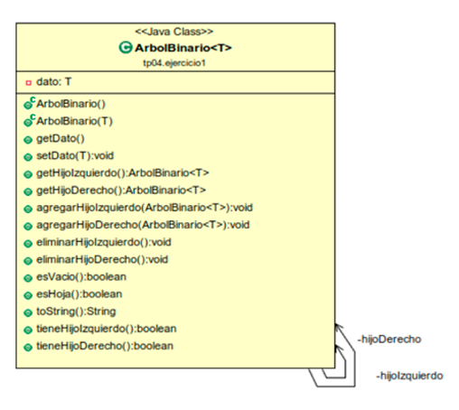

<h1 align="center">☕Practica N°3 </h1>

***Importante***Puede continuar trabajando en su proyecto AyED. El archivo zip descargado desde la página de la cátedra no es un proyecto eclipse, por lo tanto:

- `1)` Descomprima el zip
- `2)` Sobre la carpeta **src** de su proyecto AyED haga click con el botón derecho del mouse y seleccione la opción Import > FileSystem.
- `3)` Haga click en “Browse”, busque la carpeta descomprimida y seleccione la carpeta src (haga click para que aparezca el check seleccionado).
- `4)` Haga click en el botón finalizar.

### ```Objetivos```

- Representar árboles binarios e implementar las operaciones de la abstracción
- Realizar distintos tipos de recorridos sobre árboles binarios
- Describir soluciones utilizando árboles binarios

### `Ejercicio 1` [Resolución](#Ejercicio_1)

Considere la siguiente especificación de la clase Java **ArbolBinario** (con la representación hijo izquierdo e hijo derecho)

<div align="center"> 

 </div>

- El constructor **ArbolBinario(T dato)** inicializa un árbol con el dato pasado como parámetro y ambos hijos nulos.

- Los métodos **getHijoI<quierdo():ArbolBinario<T>** y **getHijoDerecho:ArbolBinario<T>** , retornan los hijos izquierdo y derecho respectivamente del árbol.

- El método **agregarHijoIzquierdo(ArbolBinario<T> unHijo)** y **agregarHijoDerecho(ArbolBinario<T> unHijo)** agrega un hijo como hijo izquierdo o derecho del árbol.

- El método **eliminarHijoIzquierdo()** y **eliminarHijoDerecho()**, eliminan el hijo correspondiente.
- El método **esVacio()** indica si el árbol está vacío y el método **esHoja()** no tiene hijos.
- El método **tieneHijoIzquierdo()** y **tieneHijoDerecho()** devuelven un booleano indicando si tiene dicho hijo el árbol receptor del mensaje

``a)``  Analice la implementación en JAVA de las clases **ArbolBinario** brindadas por la cátedra.

### `Ejercicio 2` [Resolución](#Ejercicio_2)

Agregue a la clase **ArbolBinario** los siguientes métodos:

- `a)`  **contarHojas():int** Devuelve la cantidad de árbol/subárbol hojas del árbol receptor. 

- `b)` **espejo(): ArbolBinario<T>** Devuelve el árbol binario espejo del árbol receptor. Por ejemplo:


<div align="center"> 

 </div>

- `c)` **entreNiveles(int n, m)** Imprime el recorrido por niveles de los elementos del árbol
receptor entre los niveles n y m (ambos inclusive). (0≤n<m≤altura del árbol)

### `Ejercicio 3` [Resolución](#Ejercicio_3)

Defina una clase Java denominada `ContadorArbol` cuya función principal es proveer métodos de validación sobre árboles binarios de enteros. Para ello la clase tiene como variable de instancia un `ArbolBinario<Integer>`. Implemente en dicha clase un método denominado `numerosPares()` que devuelve en una estructura adecuada (sin ningún criterio de orden) todos los elementos pares del árbol (divisibles por 2). Defina la clase dentro del paquete `tp03.ejercicio3`.

- `a)` Implemente el método realizando un recorrido **InOrden**
- `b)` Implemente el método realizando un recorrido **PostOrden**

### `Ejercicio 4` [Resolución](#Ejercicio_4)

Una red binaria es una red que posee una topología de árbol binario lleno. Por ejemplo:

<div align="center"> 

 </div>


Los nodos que conforman una red binaria llena tiene la particularidad de que todos ellos conocen cuál es su retardo de reenvío. El retardo de reenvío se define como el período comprendido entre que un nodo recibe un mensaje y lo reenvía a sus dos hijos

Su tarea es calcular el <ins>mayor</ins> retardo posible, en el camino que realiza un mensaje desde la raíz hasta llegar a las hojas en una red binaria llena.

```
Nota: asuma que cada nodo tiene el dato de retardo de reenvío expresado
en cantidad de segundos.
```

- `a)` Indique qué estrategia (recorrido en profundidad o por niveles) utilizará para resolver el problema.
- `b)` Cree una clase Java llamada **RedBinariaLlena** (dentro del paquete **tp03.ejercicio4**) donde implementará lo solicitado en el método **retardoReenvio():int**

### `Ejercicio 5` [Resolución](#Ejercicio_5)

Implemente una clase Java llamada **ProfundidadDeArbolBinario** que tiene como variable de instancia un árbol binario de números enteros y un método de instancia **sumaElementosProfundidad(int p):int** el cuál devuelve la suma de todos los nodos del árbol que se encuentren a la profundidad pasada como argumento.

Defina la clase dentro del paquete **tp03.ejercicio5**

Ejercicio_1
-----------

```Java

```

Ejercicio_2
-----------

```Java

```

Ejercicio_3
-----------

```Java

```

Ejercicio_4
-----------

```Java

```

Ejercicio_5
-----------

```Java

```
