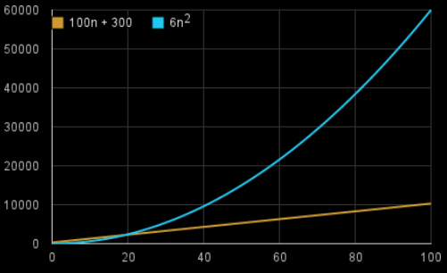

<h1 align="center">Analisis de Algoritmos</h1>

### *Indice*

- [Introducción al concepto T(n)](#Introducción_al_concepto_T(n))
- [Cálculo del T(n)](#Cálculo_del_Tiempo_de_Ejecución)

### Introducción


Nos permite comparar algoritmos en forma independiente de una plataforma en particular. Mide la eficiencia de un algoritmo, dependiendo del tamaño de la entrada

#### Pasos a seguir

- Caracterizar los datos de entrada del algoritmo
- Identificar las operaciones abstractas, sobre las que se basa el algoritmo
- Realizar un análisis matemático, para encontrar los valores de las cantidades del punto anterior

---

### Introducción_al_concepto_T(n)


Debemos enfocarnos en cuán rápido crece una función T(n) respecto al tamaño de la entrada. A esto lo llamamos la **tasa o velocidad de crecimiento** del tiempo de
ejecución.

### `Ejemplo`

Supongamos que un algoritmo, que corre con una entrada de tamaño n, tarda `6n2+100n+300` instrucciones de máquina. El término `6n2` se vuelve más grande que el resto de los términos, `100n+300` una vez que n se hace suficientemente grande, 20 en este caso

Gráfica que muestra los valores de `6n2` y de `100n+300` para valores de n de 0 a 100:





Al descartar los términos menos significativos y los coeficientes constantes, podemos enfocarnos en la parte importante del tiempo de ejecución de un algoritmo, su tasa o velocidad de crecimiento, sin involucrarnos en detalles que complican nuestro entendimiento.

Cuando descartamos los coeficientes constantes y los
términos menos significativos, usamos notación
asintótica.

### Problema

Considerando que un algoritmo requiere f(n) operaciones para resolver un problema y la computadora procesa 100 operaciones por segundo.


Si f(n) es:


<table>
<tr>
<td> a. log10 n </td> <td> b. √n </td>
</tr>
<tr>
<td>
 

$$f(n) = log_{10}n\rightarrow 4 op$$

$$100op \rightarrow 1seg$$

$$4op \rightarrow \frac{4}{100} = 0.04seg $$

</td>
<td>

$f(b) = \sqrt{n} \rightarrow  100op$

$100op \rightarrow 1seg$

$100op \rightarrow \frac{100}{100} = 1seg$


 
</td>
</tr>
 
</table>

Determine el tiempo en segundos requerido por el
algoritmo para resolver un problema de tamaño n=10000.

### Problema

Suponga que Ud. tiene un algoritmo ALGO-1 con un tiempo de ejecución exacto de 10n2. ¿En cuánto se hace más lento ALGO-1 cuando el tamaño de la entrada n
aumenta:……….?

- a.- El doble   
$$n\rightarrow 2*n$$

- b.- El triple
$$10n^{2} \rightarrow 10*(2n)^{2} = 10*4*n^{2}$$

---

## Cálculo_del_Tiempo_de_Ejecución


<table>
<tr>
<td> Estructuras </td> <td> Tiempo </td>
</tr>
<tr>
<td>
 
```java
int sum = 0;
int [] a = new int [n][n];
for (int i =1; i<= n ; i++) {
    for (int j =1; j<= n ; j++)
        sum += a[i][j];
}
```

</td>
<td>

$T(n) = cte_{1} + \sum_{i=1}^{n}\sum_{j=1}^{n}cte_{2}=$

$= cte_{1} + n*n*cte_{2}$

$\Rightarrow O(n^{2})$

</td>
</tr>
<tr>
<td>
 
```java
int [] a = new int [n];
int [] s = new int [n];
for ( int i =1; i<= n ; i++ )
    s[i] = 0;
for ( int i =1; i<= n ; i++) {
    for (int j =1; j<= i ; j++)
        s[i] += a[j];
}
```

</td>
<td>

$T(n)= cte_{1}+\sum_{i=1}^{n}cte_{2}+ \sum_{i=1}^{n} \sum_{j=1}^{i}cte_{3} = $

$= cte_{1}+n*cte_{2}+cte_{3}*\sum_{i=1}^{n}i = ....$

$\Rightarrow O(n^{2})$

</td>
</tr>
<tr>
<td>
 
```java
int x= 0;
int i = 1;
while ( i <= n) {
    x = x + 1;
    i = i + 2;
} 
```

</td>
<td>

$T(n) = cte_{1}+\sum_{i=1}^{(n+1)/2}cte_{2}$

$\Rightarrow O(n)$

</td>
</tr>
<tr>
<td>
 
```java
int x= 1;
while (x < n)
    x = 2 *x;
```

</td>
<td>

$T(n) = cte_{1}+cte_{2}*log(n)$

$\Rightarrow O(log(n))$

</td>
</tr>
</table>

```
Aclaración:
Si n es potencia de 2: realiza log(n) iteraciones
Si n no es potencia de 2: realiza log(n) + 1 iteraciones
```


---
$$T(n) = cte_{1}+\sum_{i=1}^{(n+1)/2}$$
$$ = cte_{1}+ cte_{2}/2 * (n+1) $$
$$= 0(n)$$


- [En donde pude procesar las formulas](https://www.codecogs.com/eqnedit.php)
