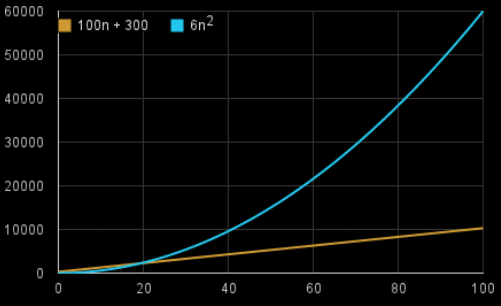

<h1 align="center">Analisis de Algoritmos</h1>

### *Indice*

- [Introducción al concepto T(n)](#Introducción_al_concepto_T(n))
- [Cálculo del T(n)](#Cálculo_del_Tiempo_de_Ejecución)
- [Problema 1](#Problema_1)
- [Problema 2](#Problema_2)
- [Problema 3](#Problema_3)
- [Problema 4](#Problema_4)
- [Algoritmos Recursivos](#Algoritmos_Recursivos)
- [Grafos](/Documentos/grafos.md)

### Introducción


Nos permite comparar algoritmos en forma independiente de una plataforma en particular. Mide la eficiencia de un algoritmo, dependiendo del tamaño de la entrada

#### Pasos a seguir

- Caracterizar los datos de entrada del algoritmo
- Identificar las operaciones abstractas, sobre las que se basa el algoritmo
- Realizar un análisis matemático, para encontrar los valores de las cantidades del punto anterior

---

### Introducción_al_concepto_T(n)


Debemos enfocarnos en cuán rápido crece una función T(n) respecto al tamaño de la entrada. A esto lo llamamos la **tasa o velocidad de crecimiento** del tiempo de
ejecución.

### `Ejemplo`

Supongamos que un algoritmo, que corre con una entrada de tamaño n, tarda `6n2+100n+300` instrucciones de máquina. El término `6n2` se vuelve más grande que el resto de los términos, `100n+300` una vez que n se hace suficientemente grande, 20 en este caso

Gráfica que muestra los valores de `6n2` y de `100n+300` para valores de n de 0 a 100:





Al descartar los términos menos significativos y los coeficientes constantes, podemos enfocarnos en la parte importante del tiempo de ejecución de un algoritmo, su tasa o velocidad de crecimiento, sin involucrarnos en detalles que complican nuestro entendimiento.

Cuando descartamos los coeficientes constantes y los
términos menos significativos, usamos notación
asintótica.

### Problema_1

Considerando que un algoritmo requiere f(n) operaciones para resolver un problema y la computadora procesa 100 operaciones por segundo.


Si f(n) es:


<table>
<tr>
<td> a. log10 n </td> <td> b. √n </td>
</tr>
<tr>
<td>


$$ f(n) = log_{10}n\rightarrow 4 op $$

$$ 100op \rightarrow 1seg $$

$$ 4op \rightarrow \frac{4}{100} = 0.04seg $$

</td>
<td>

$$f(b) = \sqrt{n} \rightarrow  100op$$

$$ 100op \rightarrow 1seg$$

$$ 100op \rightarrow \frac{100}{100} = 1seg$$


 
</td>
</tr>
 
</table>

Determine el tiempo en segundos requerido por el
algoritmo para resolver un problema de tamaño n=10000.

### Problema_2

Suponga que Ud. tiene un algoritmo ALGO-1 con un tiempo de ejecución exacto de 10n2. ¿En cuánto se hace más lento ALGO-1 cuando el tamaño de la entrada n
aumenta:……….?

- a. El doble   

$$10n^{2}\to 10*(2n)^{2}$$

$$ = 10*(4n)^{2}$$

- b. El triple  

$$10n^{2}\to 10*(3n)^{2}$$

$$ = 10*(9n)^{2}$$


## Cálculo_del_Tiempo_de_Ejecución


<table>
<td>Programa(1..5)</td>
<td>Resolución</td>
<tr>
<td>

```java
int sum = 0;
int [] a = new int [n];
for (int i =1; i<= n ; i++ )
    sum += a[i];
//12345
```
</td>
<td>
 
 Resolucion
 
 
$$ 
T(n) = cte_{1} + \sum_{i = 1}^{(n)} cte_{2} = 
$$

$$
= cte_{1} + (n) * cte_{2} 
$$

$$
\Rightarrow O(n)
$$

</td>
</tr>

<tr>
<td>

```java
int sum = 0;
int [] a = new int [n][n];
for (int i =1; i<= n ; i++) {
    for (int j =1; j<= n ; j++)
        sum += a[i][j];
}
```

</td>
<td>

$$ 
T(n) = cte_{1} + \sum_{i = 1}^{(n)} \sum_{j = 1}^{n} cte_{2}=
$$
 
$$
= cte_{1} + (n) * (n) * cte_{2} 
$$
 
$$
\Rightarrow O(n ^ {2})
$$

</td>
</tr>

<tr>
<td>

```java
int [] a = new int [n];
int [] s = new int [n];
for ( int i =1; i<= n ; i++ )
    s[i] = 0;
for ( int i =1; i<= n ; i++) {
    for (int j =1; j<= i ; j++)
        s[i] += a[j];
}
```

</td>
<td>

$$
T(n) = cte_{1} + \sum_{i = 1}^{n} cte_{2} + \sum_{i = 1}^{n} \sum_{j = 1} ^ {i} cte_{3} = 
$$

$$ 
= cte_{1} + n * cte_{2} + cte_{3} * \sum_{i = 1}^{(n)} i = 
$$
 
$$
\Rightarrow O(n^{2})
$$

</td>
</tr>

<tr>
<td>

```java
int x= 0;
int i = 1;
while ( i <= n) {
    x = x + 1;
    i = i + 2;
} 
```

</td>
<td>

$$ 
T(n) = cte_{1} + \sum_{i = 1} ^ {(n + 1)/2} cte_{2}
$$

$$
cte_{1} + cte_{2} / 2 * (n + 1)
$$
 
$$
\Rightarrow O(n)
$$

</td>
</tr>

<tr>
<td>

```java
int x= 1;
while (x < n)
    x = 2 *x;
```

</td>
<td>

$$ 
T(n) = cte_{1} + cte_{2} * log(n) 
$$

$$
\Rightarrow O(log ( n ))
$$

</td>
</tr>
</table>


```
Aclaración:
Si n es potencia de 2: realiza log(n) iteraciones
Si n no es potencia de 2: realiza log(n) + 1 iteraciones
```

### Problema_3 

¿Cuál es la expresión correcta respecto al tiempo de ejecución del siguiente segmento de código?

<table>

<td>
<table >
<tr></tr>
<td>

```Java
for (i = 0; i < n; i++)
    for (j = 1; j < n; j+=n/2)
        x = x + 1;

// El primer for es lineal y el segundo es logaritmico.
// El segundo for es constante porque no depende 
// de los datos de entrada
//El segundo for se trata como constante
```

</td>
</table>

</td>
<td>


$$ 
\sum_{i = 0}^{n} \sum_{j = 1}^{(n * 2)} cte_1
$$

$$ 
O(n)
$$

</td>
</table>


### Problema_4

Nota: Es cuadratico cuando tengo dos bucles lineales anidados

Considere el siguiente fragmento de código:

<table>
<td>
<table >
<tr></tr>
<td>

```Java
int count = 0;
int N = a.length;
for (int i = 0; i < N; i++)
    for (int j = 0; j < N; j++)
        a[j]++;
```

</td>
</table>
</td>

<td>

$$
cte_{1} + \sum_{i = 0}^{N} \sum_{j = 0}^{N} cte_{2} \to O(N ^ {2})
$$


$$
N = 3500 \to 1seg 
$$

$$ 
(3500^{2}) \to 1seg 
$$

`N` es el tamaño de la entrada


$$ 
(35000^{2}) \to 100seg 
$$


</td>

</table>

Suponga que tarda 1 seg cuando N=3500,
¿cuánto tardará aproximadamente para N=35000? Justifique su
respuesta.


### Ejemplo

<table>

<td>
<table >
<tr></tr>
<td>

```Java
private void imparesypares(int n){
    int x=0; int y=0;
    for (int i=1;i<=n;i++)
        if (esImpar(i))
            for (int j=i;j<=n;j++)
                x++;
        else
            for (int j=1;j<=i;j++)
                y++;
}
```

```Java
public boolean esImpar(int unNumero){
    if (unNumero%2 != 0)
        return true;
    else
        return false;
}
```
</td>
</table>

</td>
<td>

$$ 
 T(n) = 
$$

$$ 
\sum_{i=1}^{n}cte_{1} + \sum_{i=1}^{n[paso 2 ]} (\sum_{j=(2*i)-1}^{n} cte_{2} + \sum_{j=1}^{2*i} cte_{2})
$$

$$ 
\sum_{i=1}^{n} cte_{1} + \sum_{i=1}^{2/n} (\sum_{j=(2*i)-1}^{n} cte_{2} + \sum_{j=1}^{2*i} cte_{2})
$$

$$ 
cte_{1} * n + \sum_{i=1}^{n/2} cte_{2} * (n-(2 * i) + 1 + 1 + ( 2 * i ) - 1 + 1)
$$

$$ 
cte_{1} * n + cte_{2} * (n+2)*n/2
$$

$$ 
cte_{1} * n + cte_{2}/2*(n^2) + cte_{2} * n
$$

$$
\to O(n^2)
$$

</td>

</table>

- El metodo `esImpar` tiene todas las sentencias constantes

$$T_{esImpar}(n) = cte_{1}$$

- El metodo `imparesypares` tiene un loop en el que : cada iteración se llama al metodo `esImpar` y la mitad de las veces se ejecuta uno de los for (para valores de `i`) y la mitad restante el otro for (para valores de `i` pares)


### Ejercicio

<table>
<td>
<table >
<tr></tr>
<td>

```Java
private int ejercicio3(int n) {
  int p=0; int j=1;
  for (int i=1; i<=n; i++)
    if (esImpar(i))
      j:=j*2;
    else
      for (int k=1; k<=j; k++)
        p:= p+1;
  return p;
}
public boolean esImpar(int unNumero){
if (unNumero%2 != 0)
  return true;
else
  return false;
}
```
</td>
</table>

</td>
<td>

La mitad de las veces hace algo constante, la otra mitad hace una sumatoria

El ultimo -1 es porque la sumatoria empieza en 1

$$
n = 6
$$

$$
T(n) = \sum_{i=1}^{n} cte_{1} + \sum_{i=1}^{n/2} cte_{2} + \sum_{i=1}^{n/2} \sum_{j=1}^{2^{i}} 1 
$$

$$
cte_{1} * n + cte_{2} * \frac{n}{2} + \sum_{i=1}^{n/2} 2^{i}
$$

$$
cte_{1} * n + cte_{2} * \frac{n}{2} + 2^{\frac{n}{2} + 1} - 1 - 1
$$

El ultimo -1 es porque la sumatoria empieza en 1

$$
 \to O(2^{n})
 $$

</td>
</table>


### Ejercicio

<table>

<td>

```Java

i = 0; j =0;
while(i<1000)
  for( int k = i; k <= n; k++ ) {
    i++;
    j++; }
for( int p = 0; p < n*n; p++ )
  for( int q = 0; q < p; q++ )
    j-;

```

</td>

<td>

¿Con qué valor termina la viariable i?

- `Rta` Con n + 1

Porque la condicion dentro del for no se cumpliria cuando K lo supere

Si no queremos que quede en un loop infinito, el n tendria que ser 999

¿Cuántas veces se ejecuta la sentencia 3?

O(n)

</td>

</table>

---

## Algoritmos_Recursivos

### Ejemplo 1

<table >
<td>
<table >
<tr></tr>
<td>


```Java
public static int factorial( int n ) {
  if (n == 1)
    return 1;
  else 
    return n * factorial( n - 1 );
}

```


</td>
</table>

Termina cuando n-i = 1

</td>

<td>

$$
T(n) \begin{cases}
 & cte_{1} \to n= 1\\
 & T(n-1) + cte_{2}  \to n>1 
\end{cases}
$$

Paso 1

$$
T(n) = T(n-1) + cte_{2} = (T(n - 2) + cte_{2}) + cte_{2}
$$

Paso 2

$$
T(n) = T(n-2) + 2cte_{2} = (T(n - 3) + cte_{2}) + 2cte_{2}
$$

Paso i

$$
T(n) = T(n - i) + i * cte_{2}
$$

$$
T(n) = T(1) + (n-1) * cte_{2}
$$

$$
T(n) = cte_{1} + (n-1) * cte_{2}
$$

Es lineal
(Todos los algoritmos recursivos se resuelven de la misma manera)


</td>
</table>

### Ejemplo 2

Encontrar el máximo elemento en un arreglo de
enteros tomando n posiciones a partir de la
posición i

<table>
<td>

```Java
/** Calcula el Máximo en un arreglo. */
public static int max( int [] a, int i, int n ) {
  int m1; int m2;
  if (n == 1)
    return a[i];
  else { 
    m1 = max (a, i, n/2);
    m2 = max (a, i + (n/2), n/2);
    if (m1<m2)
      return m2;
    else 
      return m1;
       }
  }
```
</td>
<td>

$$
T(n) \begin{cases}
 & cte_{1} \to n= 1\\
 & 2 * T(n/2) + cte_{2}  \to n>1 
\end{cases}
$$

$$
T(n) =
$$

$$
 2 * T(n/2) + cte_{2} = 2 * [2 * T(n/4) + cte_{2}] + cte_{2} 
$$

$$
4 * T(n/4) + 3 cte_{2} = 4 * [2 * T(n/8) + cte_{2}] + 3 cte_{2} 
$$

$$
 8 * T(n/8) + 7 cte_{2} = 8 * [2 * T(n/16) + cte_{2}] + 7 cte_{2} 
$$

$$
 2^{i} * T(n/2^{i}) + (2^{i} - 1) *  cte_{2} 
$$

Buscamos el corte 

$$
  n/2^{i} = 1
$$

$$
  n = 2^{i}
$$

$$
  i = log_{2} n
$$

Remplazamos

$$
T(n) = n * T(n/n) + (n - 1) * cte_{2}
$$

$$
n * cte_{1} + (n - 1) * cte_{2}
$$

$$
O(n)
$$

</td>
</table>

## Notación Big_Oh

